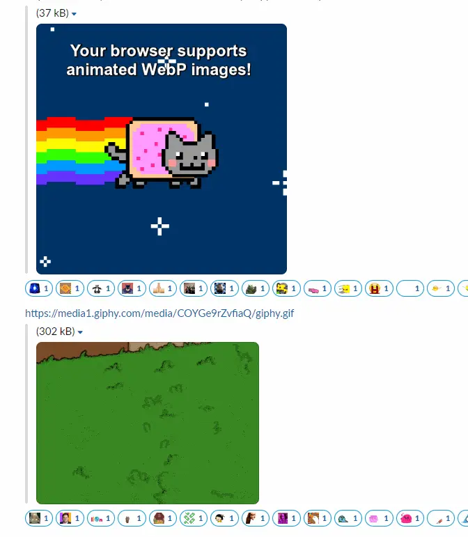

# Deanimator

Deanimator is a Go package that can detect animated images and "deanimate" them by rendering just the first frame as a static image.

Busy Slack:



Becomes Calm Slack:


## Installation

Add the module via `go mod`:

```
go get github.com/slackhq/deanimator
```

## Usage

When using the module, make sure to import / register the deanimation libraries you want to support (similar to the `image` package in the standard library). For example:

```
import (
	_ "github.com/slackhq/deanimator/gif"
	_ "github.com/slackhq/deanimator/png"
	_ "github.com/slackhq/deanimator/webp"
)

More information can be found in the [Go package documentation](https://pkg.go.dev/github.com/slackhq/deanimator#section-documentation).
